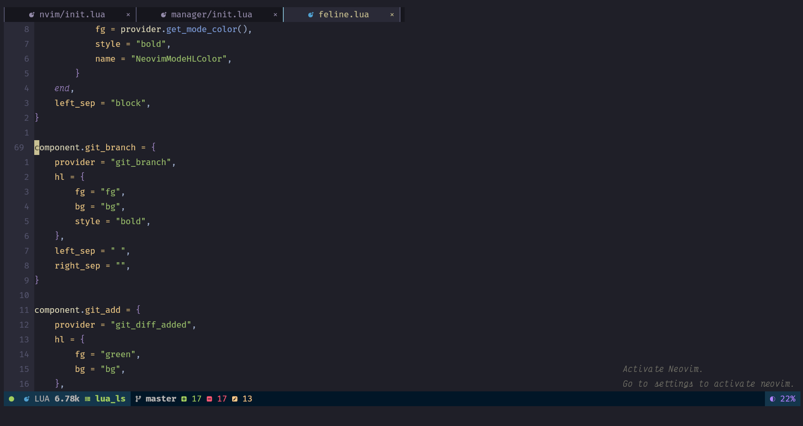
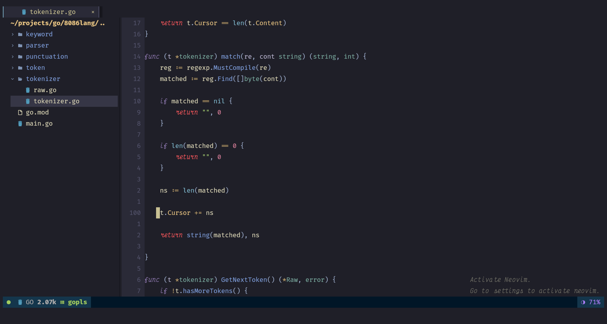

# NeoNeedsKey: Yo Ho Ho, Activate Your Vim or Walk the Plank!





Ahoy, mateys! Sailin' the open-source seas without a license? NeoNeedsKey gently
reminds you (with a touch of pirate humor) that even digital heroes gotta support the
devs!

## What it be doin'

* Shows a playful message upon launchin' Neovim, reminding you to activate.
* No constant naggin': The message stays there until you take action.
* Run :ActivateNeovim to ditch the message and unlock full Vim power.

## Why use it?

* Supports the devs without the constant naggin'.
* Customizable timeout: Set the time it takes for the message to appear (so you can
  prepare your eye patch!).

## Setup

To setup this plugin just call the setup function.

```lua
require("NeoNeedsKey").setup()
```

### Configuration

The setup function accepts a table.


| Field | Type | Default Value(s) |
|:-:|:-:|:-|
|timeout|integer|10|
|position|string|`bottom-right`|

The possible position values are:

- *bottom-right*
- *bottom-left*
- *top-right*
- *top-left*

```lua
require("NeoNeedsKey").setup {
    timeout = 10,
    position = "bottom-right"
}
```

Enjoy, ye scallywags! (But seriously, activate!)

P.S. Don't walk the plank, support the devs!

## Customization

* Adjust the timeout to your heart's content.

Still ain't convinced? It's free, fun, and helps keep Vim sailin' smooth. So give it a whirl!

*P.S.* While NeoLock provides a lighthearted nudge, remember that activating your Vim
is vital for its continued development and ethical software use. Let's support the
creators and unlock the full Vim potential together!
